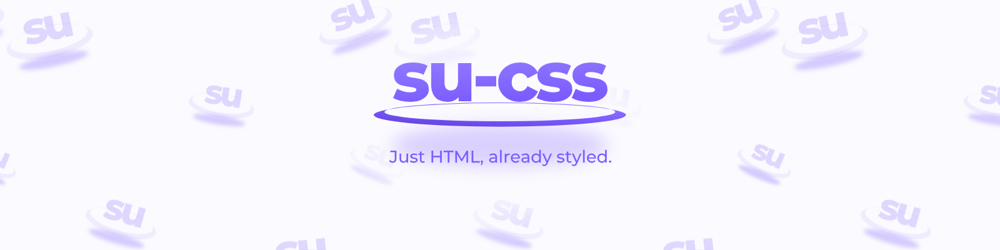

<p align="center">
  <a href="https://ryotasugawara.github.io/su-css/">
    
  </a>
</p>

# SuCSS

**Just HTML, already styled.**

[](https://github.com/RyotaSugawara/su-css/actions/workflows/ci.yml)
[](https://www.npmjs.com/package/@ryo9ra/su-css)
[](LICENSE)

A classless CSS framework. Write plain semantic HTML — no class names, no custom
attributes — and get a liquid-glass design with dark mode and accessibility
built in.

**Demo: https://ryotasugawara.github.io/su-css/**

> *Su* (素) is Japanese for "plain" or "unadorned" — SuCSS styles plain HTML.

## Features

- **No class names.** Styling comes from the elements themselves: `<header>`,
  `<main>`, `<article>`, `<button>`, `<dialog>`, `<table>`, and friends.
- **Dark mode included.** Follows `prefers-color-scheme`, and can be forced with
  `data-theme="light"` or `data-theme="dark"`.
- **Accessible by default.** WCAG AA/AAA contrast, visible `:focus-visible`
  rings, adequate touch targets, and `prefers-reduced-motion` /
  `prefers-reduced-transparency` support.
- **Liquid glass surfaces.** Panels behave like a lens rather than a frosted
  sheet: the backdrop stays legible through them, colour blooms out of them,
  and every edge carries a specular rim. Controls are capsule-shaped and settle
  with a short overshoot.
- **Small and dependency-free.** One CSS file, no build step. The look needs
  no JavaScript at all — an optional script adds keyboard behaviour to the
  few patterns that need it (`role="toolbar"`, for now).
- **Themeable.** Every color, radius, and shadow is a CSS custom property.

## Install

```bash
npm install @ryo9ra/su-css
```

| Import specifier | File | Size |
| --- | --- | --- |
| `@ryo9ra/su-css` | `dist-lib/sucss.css` | 70 KB (18.1 KB gzipped) |
| `@ryo9ra/su-css/sucss.min.css` | `dist-lib/sucss.min.css` | 36 KB (6.6 KB gzipped) |
| `@ryo9ra/su-css/behaviors.js` | `dist-lib/behaviors.js` + its own imports | 5.2 KB (2.4 KB gzipped) |
| `@ryo9ra/su-css/behaviors.min.js` | `dist-lib/behaviors.min.js` | 1.3 KB (0.7 KB gzipped) |

From a bundler (Vite, webpack, Next.js, …):

```js
import '@ryo9ra/su-css/sucss.min.css';
```

Or straight from a CDN, with no install at all:

```html
<link rel="stylesheet" href="https://cdn.jsdelivr.net/npm/@ryo9ra/su-css/dist-lib/sucss.min.css">
```

> That URL always serves the newest release. While SuCSS is on `0.x`, minor
> releases may still change how things look, so pin an exact version in
> production by appending it to the package name —
> `@ryo9ra/su-css@1.2.3/dist-lib/sucss.min.css`.

### Optional keyboard behaviors

The stylesheet alone gets every element to a reachable, focus-visible state,
`role="toolbar"` included — Tab reaches it, but the arrow keys inside it do
nothing on their own, because that is scripted behaviour and this package
ships none by default. `behaviors.js` is that script, opted into separately:

```js
import '@ryo9ra/su-css/behaviors.js';
```

Importing it scans the page once for the patterns it knows and wires up
their standard keyboard behaviour — right now, roving-tabindex arrow-key
navigation for `role="toolbar"`. It reads the same markup the stylesheet
already does: no new attribute, no class. Nothing about the way something
*looks* depends on this import; skip it and a toolbar is still a toolbar,
just one where only Tab moves through it.

`behaviors.js` imports two small files of its own — reading them as written
is the point, matching the stylesheet's own no-build-step story. A page that
would rather pay a build step for one smaller request instead can import
`behaviors.min.js` in its place: the same script, bundled and minified, same
as `sucss.min.css` is to `sucss.css`.

```html
<script type="module" src="https://cdn.jsdelivr.net/npm/@ryo9ra/su-css/dist-lib/behaviors.min.js"></script>
```

For DOM added after that initial scan — a panel inserted by your own script,
say — call `enhance` yourself instead, which does the same scan without the
side effect of running on import, so a bundler can drop it entirely when
nothing calls it:

```js
import {enhance} from '@ryo9ra/su-css/behaviors/enhance.js';

enhance(); // the whole document, same as importing behaviors.js
enhance(myNewPanel); // or scoped to a subtree
```

## Usage

Link the stylesheet and write ordinary HTML. That is the whole API.

```html
<!DOCTYPE html>
<html lang="en">
<head>
  <meta charset="UTF-8">
  <meta name="viewport" content="width=device-width, initial-scale=1.0">
  <title>My Website</title>
  <link rel="stylesheet" href="https://cdn.jsdelivr.net/npm/@ryo9ra/su-css/dist-lib/sucss.min.css">
</head>
<body>
  <header>
    <nav>
      <strong>My Site</strong>
      <a href="#about">About</a>
    </nav>
  </header>

  <main>
    <article>
      <h1>Hello!</h1>
      <p>This page does not contain a single class name.</p>
      <button type="submit">Send</button>
      <button type="reset">Reset</button>
    </article>
  </main>
</body>
</html>
```

Interactive elements work natively too: `<dialog>` for modals,
`<details>`/`<summary>` for accordions, `<input type="checkbox" role="switch">`
for toggles, and `popovertarget` with `[popover]` for a panel that opens and
closes with no script at all — the panel shares its glass surface with
`<dialog>` rather than a separate look of its own.

ARIA carries structure as well as state. A `role="group"` around a set of
buttons spaces them as one cluster, and every button in it keeps the look its
own markup gives it. Give those buttons `aria-pressed` (or the links
`aria-current`) and the same group becomes a segmented control, because a set
of buttons that carries a selection is a choice rather than a cluster. A
`role="toolbar"` becomes a bar of commands, where an `<hr>` stands up as a
separator and `aria-orientation="vertical"` stacks it.

> A toolbar also asks Tab to enter it once and the arrow keys to move inside
> it. SuCSS draws the bar; `@ryo9ra/su-css/behaviors.js` writes the keyboard
> part — see below — or write it yourself. When you cannot do either, reach
> for `role="group"` instead: it carries no such expectation.

State works the same way. `aria-invalid="true"` marks a field as in error,
`aria-disabled` and `inert` fade what cannot be operated, `aria-busy` puts a
turning ring on what is still loading, `aria-expanded` turns a chevron toward
what a button opens, `aria-sort` marks the column a table is ordered by, and a
message that carries a sentence takes a block: `role="alert"` for something
wrong, `role="note"` for something worth knowing. There is no success or
warning colour, because severity has no ARIA role to hang one on.

> Keeping `aria-expanded` in step with an open `[popover]` is the one thing
> the browser does not do for you — only `<details>` gets that for free. A few
> lines on the panel's own `toggle` event are enough; SuCSS's demo site does
> exactly that.

## Theming

Override custom properties on `:root`. Shifting `--hue` recolors the whole page,
including the background gradient.

```css
:root {
  --hue: 210;               /* 0-360 */
  --sat: 80%;
  --radius: 12px;
  --glass-blur: 14px;       /* how far the material blurs what is behind it */
  --glass-saturate: 200%;   /* how much colour it pushes through */
  --glass-brightness: 1.04; /* lifts the backdrop in light mode; set below 1 to sink it */
}
```

The material itself is described by `--glass-tint` (the diagonal sheen),
`--glass-rim` (the specular edge) and `--glass-inset` (the concave inner shadow
on fields and tracks). `--glass-brightness` is what keeps text on glass readable
as the surfaces get more transparent, so lower it rather than raising
`--glass-bg` if a theme reads too washed out.

Dark mode follows the operating system by default. To control it yourself, set
`data-theme` on `<html>`:

```html
<html lang="en" data-theme="dark">
```

## Browser support

Modern evergreen browsers: Chrome/Edge 111+, Safari 16.4+, Firefox 128+.
Browsers without `backdrop-filter` fall back to solid surfaces.

## Development

This repository also contains the demo site: hand-written HTML pages with no
class attributes, styled entirely by the framework. `index.html` doubles as the
element reference; `customize.html` is a live editor for the custom properties.

A page is a template plus a dictionary: `src/pages/*.html` holds the structure,
`src/locales/*.json` holds every string on the site, one file per language. The
build renders `/` and `/ja/` from them, so each language ships as a real static
page with the text in the markup and no JavaScript involved. The rendered pages
are build output, not source — `npm run dev` and `npm run build` produce them.

```bash
npm install
npm run dev      # start the dev server
npm run build    # build the demo site
npm run lint     # TypeScript + Stylelint
npm run test     # unit, contrast, CSS structure and page tests
npm run build:pages  # render the pages on their own (dev and build do it first)
npm run build:review # one page showing every ARIA case, to look at a change
```

`npm run build:review` writes `dist-review/index.html`: every element, ARIA
role and state the framework styles, each in its own document, against the
current `src/lib/sucss.css`. It is one self-contained file with a light/dark
and a phone/tablet/full switch, so a change can be looked at without running
the site.

The stylesheet itself is a single hand-written file:
[`src/lib/sucss.css`](src/lib/sucss.css). The optional keyboard behaviors are
hand-written too, unbundled, under [`src/behaviors/`](src/behaviors) —
[#55](https://github.com/RyotaSugawara/su-css/issues/55) explains why no
build step is needed to *run* them. `npm run build:lib` copies both into
`dist-lib/` as published, and minifies each — the CSS into `sucss.min.css`,
the behaviors bundled into one `behaviors.min.js` — as an option next to the
readable original, never in place of it. `npm run release:dry-run` shows
exactly what would be published.

Versioning is automated. Land [Conventional Commits](https://www.conventionalcommits.org/)
on `main` (`feat:`, `fix:`, `feat!:`) and release-please keeps a release PR open
with the next version and changelog; merging it cuts the release. Releases then
go through npm's staging queue, where a maintainer approves them with a 2FA
challenge before they become installable.

The test suite parses `src/lib/sucss.css` directly: `tests/css/contrast.test.ts`
checks every token pair against WCAG AA in both themes, and
`tests/css/structure.test.ts` asserts the accessibility features promised above
are actually present. `tests/behaviors/` tests the keyboard behaviors the same
way a person would use them — see CONTRIBUTING.md for why that one needs a
real browser instead.

Conventions, the invariants the stylesheet has to hold to, and how to get a
change released: [CONTRIBUTING.md](CONTRIBUTING.md) and
[docs/RELEASING.md](docs/RELEASING.md).

To report a security problem, use private vulnerability reporting rather than an
issue: [SECURITY.md](SECURITY.md).

## Brand

Icons, logos, the cover artwork and the palette live in
[`assets/brand/`](assets/brand), and how to use them is written down in
[docs/BRAND.md](docs/BRAND.md).

## License

[MIT](LICENSE)
